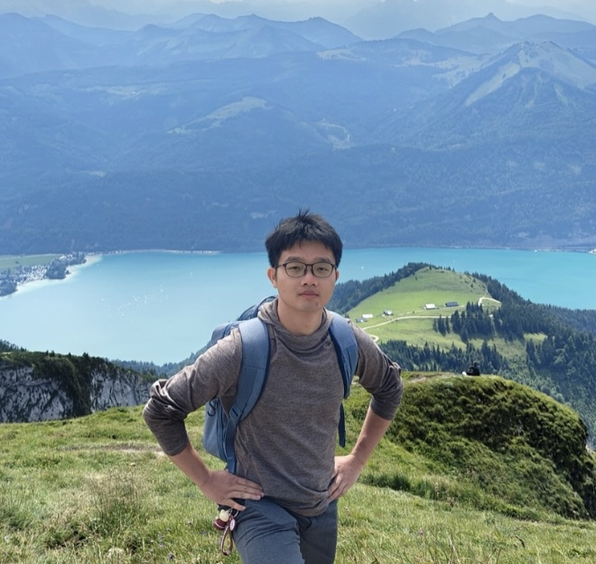

```
I don't believe it. 
-Luke Skywalker
That is why you fail.
-Yoda
```

<span style="font-family: 'Times', sans-serif; color:maroon">*Math for Life Science and Autonomous Machines with Humancare.*</span>

<span style="font-family: 'Times', sans-serif;">I am currently working in the Department of Mathematics at Jinan (暨南) University in Guangzhou, China. I got my PhD in applied mathematics at Sun Yat-sen University in 2022. My research focuses on developing advanced **non-i.i.d.-oriented machine learning algorithms** for heterogeneous biomedical data, including multi-omics and single-cell data, as well as histopathological images.</span>



<span style="font-family: 'Times', sans-serif;">Publications</span>
======
* <span style="font-family: 'Times', sans-serif;">Lai Z-R, **Wang W📧**. Invariant risk minimization is a total variation model. In: *Proceedings of the 41st International Conference on Machine Learning (ICML 2024)*. Vienna, Austria: 2024: 25913-25935. [[code](https://github.com/laizhr/IRM-TV)]</span>
* <span style="font-family: 'Times', sans-serif;">Yang J, **Wang W📧**, Zhang X. scSemiGCN: boosting cell-type annotation from noise-resistant graph neural networks with extremely limited supervision. *Bioinformatics*, 2024, 40(2): btae091.[[code](https://github.com/Jane9898/scSemiGCN)]</span>
* <span style="font-family: 'Times', sans-serif;">**Wang W**, Zhang X, Dai D-Q. springD2A: capturing uncertainty in disease-drug association prediction. *Bioinformatics*, 2022, 38(5):1353–1360.[[code](https://github.com/wangyuanhao/springD2A)]</span>
* <span style="font-family: 'Times', sans-serif;">Zhang X, **Wang W**, Ren C-X, Dai D-Q. Learning representation for multiple biological networks via a robust graph regularized integration approach. *Briefings in Bioinformatics*, 2022, 23(1):bbab409.[[code](https://github.com/XWenZhang/EnMUGR)]</span>
* <span style="font-family: 'Times', sans-serif;">Song W, **Wang W**, Dai D-Q. Subtype-WESLR: identifying cancer subtype with weighted ensemble sparse latent representation of multi-view data. *Briefings in Bioinformatics*, 2022, 23(1):bbab398.[[code](https://github.com/songwenjing123/subtype-WESLR)]</span>
*  <span style="font-family: 'Times', sans-serif;">Liu Y, **Wang W**, Ren C-X, Dai D-Q. MetaCon: meta contrastive learning for microsatellite instability detection. In: *24th International Conference on Medical Image Computing and Computer-Assisted Intervention (MICCAI)*. Strasbourg, France: 2021:267–276.</span>
* <span style="font-family: 'Times', sans-serif;">**Wang W**, Zhang X, Dai D-Q. DeFusion: a denoised network regularization framework for multi-omics integration. *Briefings in Bioinformatics*, 2021, 22(5):bbab057.[[code](https://github.com/wangyuanhao/DeFusion)]</span>

<span style="font-family: 'Times', sans-serif;">📧Corresponding Author</span>

<span style="font-family: 'Times', sans-serif;">Teaching</span>
======
* <span style="font-family: 'Times', sans-serif;">*Calculus I* for undergraduates (Autumn 2022, Autumn 2023, [Autumn 2024](https://wangyuanhao.github.io/calculus_course_webpage/))</span>
* <span style="font-family: 'Times', sans-serif;">*Probability and Mathematical Statistics* for undergraduates (Spring 2023)</span>
* <span style="font-family: 'Times', sans-serif;">*High-dimensional Data Analysis* for MSc (Spring 2023, Spring 2024)</span>
* <span style="font-family: 'Times', sans-serif;">*Optimization Methods* for MSc (Spring 2024)</span>

